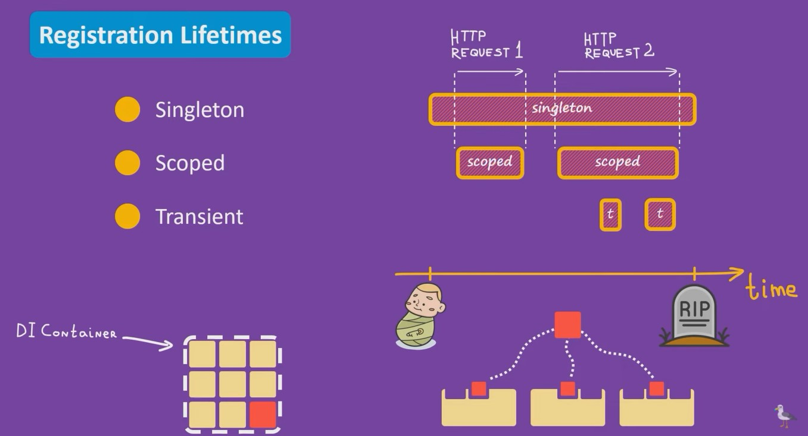
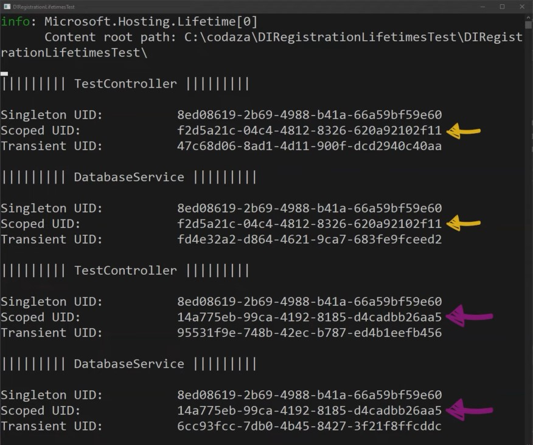

# ASP.NET Dependency Injection Lifetimes #

В ASP.NET Core для внедрения зависимостей применяют специальный DI Container, автоматически создающийся при создании приложения на данной платформе. В нем мы обязаны регистрировать все сервисы, используемые в проекте. 
У некоторого сервиса из нашего DI Container тоже могут быть зависимости от уже других сервисов, расположеных в контейнере. То есть он не сможет выполнять весь свой функционал, пока ему не будут внедрены необходимые зависимости (например, Logger или сервис для работы с Database).

Регистрация сервисов в DI контейнере ASP.NET Core может проводиться с различным времени жизни.

С каким же временем жизни может быть зарегистирован сервис в DI Container приложения на ASP.NET? Варианта всего 3!

На протяжении всей жизни нашего приложения к нему может приходить множество HTTP-запросов с разным временем исполнения, короткие и сравнительно длинные (сложная и массивная выборка из БД).

Transient - создание нового instance (экземпляра), при каждом внедрении. Все сервисы, в которые производится внедрение данного сервиса, получат новый объект. Допустим, при первом HTTP-запросе не было задействовано объектов, требующих внедрения нашего сервиса, значит новых инстансов не будет. Иначе, когда при запросе требуется несколько внедрений, то создаться необходимое количество новых инстансов. Является №1 для создания легковесных микросервисов, не создающих проблем с многопоточностью и имеющих низкий риск для утечек памяти.

Scoped - создание нового instance (экземпляра) на все внедрения для каждого запроса. Все объекты, которым будет внедрен данный сервис, получат один и тот же объект, но только на время исполнения HTTP-запроса. При получении нового запроса данный сервис будет заново инстанцироваться (физически другой объект в памяти). Является отличным вариантом, когда нам нужно хранить состояние на протяжении всего запроса (например, при использовании репозитория для обращения к БД).

Singleton - создание одного instance (экземпляра) на все внедрения и все запросы. Все объекты, которым требуется Dependency Injection данного сервиса, будут получать доступ к единствено возможному экземпляру. Является отличным вариантом, когда нам нужно хранить состояние на протяжении жизни всего приложения. Самый эффективный способ использования памяти, так как объект создается всего один раз (например, логирование, кеширование данных, фоновые сервисы и тд). Но также могут возникнуть проблемы с многопоточностью и утечкой памяти.
 

В коде есть 3 инферфейса, наследующихся базовый интерфейс ITestService, хранящего свойство уникального индикатора сервиса UID. Каждый из интерфейсов представляет какой-то свой паттерн, их реализация находится в классе TestService. 
Также необходимое определение сервисов в DI Container прописано в главном классе Program.
Класс DatabaseService для работы с условной БД необходим нам только лишь для того, чтобы спровоцировать цепочку инъекций и тем самым посмотреть как работает Scoped.

Вся необходимая информация тут https://metanit.com/sharp/aspnet5/6.2.php